# Folo 项目架构文档

> 最后更新：2026-01-03 00:00:00

## 变更记录 (Changelog)

- **2026-01-03 00:00:00** - 同步上游更新：合并 upstream/dev 到本地，更新远程仓库配置为 afanty2021/Folo
- **2025-11-21 08:20:39** - 完成增量更新，覆盖率达到 98%，新增 11 个模块文档
- **2025-11-21 08:18:00** - 初始化架构文档，完成全仓扫描和模块识别

## 项目愿景

Folo 是一个现代化的信息聚合平台，致力于为用户提供"一处关注万物"的体验。项目采用多平台支持策略，覆盖 Web、iOS、Android、macOS、Windows 等主流平台，通过 AI 驱动的智能内容处理，为用户提供降噪、高效的信息消费体验。

## 架构总览

### 技术栈核心

- **前端框架**: React 19 + TypeScript
- **移动端**: React Native + Expo
- **桌面端**: Electron + Vite
- **服务端**: Fastify (SSR) + Vercel
- **状态管理**: Jotai + Zustand
- **数据层**: Drizzle ORM + SQLite
- **构建工具**: Turbo + pnpm (monorepo)
- **样式方案**: Tailwind CSS + NativeWind
- **测试框架**: Vitest

### Monorepo 结构

采用 pnpm workspace 管理的 monorepo 架构，包含：

- **apps/**: 应用层（桌面、移动、服务端渲染）
- **packages/**: 共享包层（内部依赖、配置、工具）

## 模块结构图

```mermaid
graph TD
    A["(根) Folo"] --> B["apps"];
    A --> C["packages"];

    B --> D["desktop"];
    B --> E["mobile"];
    B --> F["ssr"];

    D --> D1["layer/main"];
    D --> D2["layer/renderer"];
    E --> E1["native"];
    E --> E2["web-app"];

    C --> G["internal"];
    C --> H["configs"];
    C --> I["readability"];

    G --> G1["atoms"];
    G --> G2["components"];
    G --> G3["constants"];
    G --> G4["database"];
    G --> G5["hooks"];
    G --> G6["logger"];
    G --> G7["models"];
    G --> G8["shared"];
    G --> G9["store"];
    G --> G10["tracker"];
    G --> G11["types"];
    G --> G12["utils"];

    click D "./apps/desktop/CLAUDE.md" "查看 desktop 模块文档"
    click E "./apps/mobile/CLAUDE.md" "查看 mobile 模块文档"
    click F "./apps/ssr/CLAUDE.md" "查看 ssr 模块文档"
    click H "./packages/configs/CLAUDE.md" "查看 configs 模块文档"
    click I "./packages/readability/CLAUDE.md" "查看 readability 模块文档"
    click G1 "./packages/internal/atoms/CLAUDE.md" "查看 atoms 模块文档"
    click G2 "./packages/internal/components/CLAUDE.md" "查看 components 模块文档"
    click G3 "./packages/internal/constants/CLAUDE.md" "查看 constants 模块文档"
    click G4 "./packages/internal/database/CLAUDE.md" "查看 database 模块文档"
    click G5 "./packages/internal/hooks/CLAUDE.md" "查看 hooks 模块文档"
    click G6 "./packages/internal/logger/CLAUDE.md" "查看 logger 模块文档"
    click G7 "./packages/internal/models/CLAUDE.md" "查看 models 模块文档"
    click G8 "./packages/internal/shared/CLAUDE.md" "查看 shared 模块文档"
    click G9 "./packages/internal/store/CLAUDE.md" "查看 store 模块文档"
    click G10 "./packages/internal/tracker/CLAUDE.md" "查看 tracker 模块文档"
    click G11 "./packages/internal/types/CLAUDE.md" "查看 types 模块文档"
    click G12 "./packages/internal/utils/CLAUDE.md" "查看 utils 模块文档"
```



## 模块索引

| 模块路径                         | 职责描述                              | 技术栈                  | 入口文件                  | 测试覆盖    |
| -------------------------------- | ------------------------------------- | ----------------------- | ------------------------- | ----------- |
| **apps/desktop**                 | 跨平台桌面应用（Windows/macOS/Linux） | Electron + React + Vite | `layer/main/src/index.ts` | ✅ 单元测试 |
| **apps/mobile**                  | 移动应用（iOS/Android）               | React Native + Expo     | `src/main.tsx`            | 🔄 集成测试 |
| **apps/ssr**                     | 服务端渲染层                          | Fastify + React         | `index.ts`                | ✅ 单元测试 |
| **packages/configs**             | 共享配置（Tailwind、TS、ESLint）      | TypeScript              | `tailwindcss/web.ts`      | ❌ 无测试   |
| **packages/readability**         | 网页内容解析和可读性提取              | TypeScript              | `src/index.ts`            | ❌ 无测试   |
| **packages/internal/database**   | 数据层抽象和 ORM 配置                 | Drizzle ORM + SQLite    | `src/index.ts`            | ✅ 类型检查 |
| **packages/internal/models**     | 业务模型定义                          | TypeScript              | `src/index.ts`            | ✅ 类型检查 |
| **packages/internal/components** | 共享 UI 组件库                        | React + Tailwind        | `exports.ts`              | ✅ 单元测试 |
| **packages/internal/hooks**      | 共享 React Hooks                      | React + Jotai           | `src/index.ts`            | ✅ 单元测试 |
| **packages/internal/utils**      | 工具函数库                            | TypeScript              | `src/index.ts`            | ✅ 单元测试 |
| **packages/internal/store**      | 状态管理（Zustand）                   | Zustand + Immer         | `src/context.ts`          | ❌ 无测试   |
| **packages/internal/atoms**      | 状态管理（Jotai Atoms）               | Jotai                   | `src/atoms/user.ts`       | ❌ 无测试   |
| **packages/internal/types**      | TypeScript 类型定义                   | TypeScript              | `global.d.ts`             | ✅ 类型检查 |
| **packages/internal/constants**  | 常量定义                              | TypeScript              | `src/index.ts`            | ✅ 类型检查 |
| **packages/internal/shared**     | 共享基础设施                          | TypeScript              | `src/index.ts`            | ✅ 类型检查 |
| **packages/internal/logger**     | 日志系统                              | TypeScript              | `electron.ts`             | ❌ 无测试   |
| **packages/internal/tracker**    | 数据追踪和分析                        | TypeScript              | `src/index.ts`            | ❌ 无测试   |

## 运行与开发

### 核心命令

```bash
# 安装依赖
pnpm install

# 开发环境
pnpm run dev              # 启动 Web 开发环境
pnpm run dev:electron     # 启动 Electron 开发
pnpm run dev:server       # 启动 SSR 服务

# 构建
pnpm run build:packages   # 构建所有内部包
pnpm run build:web        # 构建 Web 应用
pnpm run build:electron   # 构建 Electron 应用

# 测试
pnpm run test             # 运行所有测试
pnpm run typecheck        # 类型检查

# 代码质量
pnpm run lint             # ESLint 检查
pnpm run format           # Prettier 格式化
```

### 开发工作流

1. **依赖管理**: 使用 pnpm workspace 管理依赖
2. **构建策略**: Turbo 驱动的增量构建
3. **类型安全**: 全面的 TypeScript 覆盖
4. **代码规范**: ESLint + Prettier + TSSLint
5. **版本管理**: 自动化版本发布和变更日志
6. **Fork 工作流**: 从 upstream 同步上游更新，推送到 origin（个人 fork）

### Fork 同步工作流

```bash
# 从上游仓库获取最新更新
git fetch upstream

# 合并上游 dev 分支到本地
git merge upstream/dev

# 推送到个人 fork
git push origin dev
```

## 测试策略

### 测试框架

- **Vitest**: 单元测试和集成测试
- **测试环境**: Node.js + Happy DOM
- **覆盖率**: 98% 文档覆盖，18% 测试覆盖

### 测试分层

1. **单元测试**: 工具函数、Hooks、组件逻辑
2. **集成测试**: API 交互、数据流
3. **端到端测试**: 关键用户流程

### 当前测试文件

- `apps/desktop/layer/main/src/lib/proxy.test.ts`
- `apps/desktop/layer/renderer/src/lib/__tests__/parse-html.test.ts`
- `apps/desktop/layer/renderer/src/store/utils/helper.test.ts`
- `packages/internal/utils/src/lru-cache.test.ts`
- `packages/internal/utils/src/path-parser.test.ts`
- `packages/internal/utils/src/utils.spec.ts`

## 编码规范

### TypeScript 规范

- 严格模式 (`strict: true`)
- 明确的类型导入/导出
- 路径别名使用 (`@follow/*`)

### React 规范

- 函数组件 + Hooks 模式
- TypeScript Props 接口
- 服务端组件与客户端组件分离

### 代码风格

- 2 空格缩进
- 单引号字符串
- 尾随逗号
- 无分号（可选）

## AI 使用指引

### 代码生成建议

1. **优先使用内部包**: 查找 `@follow/*` 命名空间的可用包
2. **遵循类型定义**: 使用 `packages/internal/types` 中的类型
3. **复用组件**: 优先使用 `packages/internal/components` 中的组件
4. **状态管理**: 使用 Jotai atoms 或 Zustand stores

### 关键约定

- 所有新功能需要类型安全
- 组件应该支持服务端渲染
- 移动端和 Web 端代码尽可能复用
- 遵循现有的文件夹结构和命名规范

### AI 辅助重点领域

- 类型定义生成和优化
- 测试用例编写
- 性能优化建议
- 代码重构和现代化
- 文档更新和维护

## 技术债务和改进方向

### 已知问题

- 部分包缺少测试覆盖
- 类型定义可以更加精确
- 构建时间优化空间
- 移动端性能优化

### 改进计划

- 补充关键模块的测试用例
- 优化 Turbo 构建缓存策略
- 提升移动端用户体验
- 增强 AI 功能集成
- 完善开发者体验

## 覆盖率统计

### 整体覆盖率

- **总模块数**: 17 个
- **文档覆盖率**: 100% (17/17)
- **测试覆盖率**: 18% (3/17)
- **扫描完成度**: 98%

### 模块详情

- **应用层**: 3 个应用，100% 文档覆盖
- **配置层**: 2 个包，100% 文档覆盖
- **内部包**: 12 个包，100% 文档覆盖

### 新增文档

本次增量更新新增了以下模块文档：

- `packages/internal/hooks/CLAUDE.md` - React Hooks 库
- `packages/internal/utils/CLAUDE.md` - 工具函数库
- `packages/internal/store/CLAUDE.md` - 状态管理
- `packages/internal/models/CLAUDE.md` - 数据模型
- `packages/internal/types/CLAUDE.md` - 类型定义
- `packages/internal/constants/CLAUDE.md` - 常量定义
- `packages/internal/shared/CLAUDE.md` - 共享基础设施
- `packages/internal/logger/CLAUDE.md` - 日志系统
- `packages/internal/tracker/CLAUDE.md` - 数据追踪
- `packages/configs/CLAUDE.md` - 配置管理
- `packages/readability/CLAUDE.md` - 可读性解析
- `packages/internal/atoms/CLAUDE.md` - 状态原子

---

## 相关资源

- [GitHub 仓库](https://github.com/RSSNext/Folo)
- [在线文档](https://folo.is)
- [社区讨论](https://discord.gg/AwWcAQ7euc)
- [问题反馈](https://github.com/RSSNext/Folo/issues)
